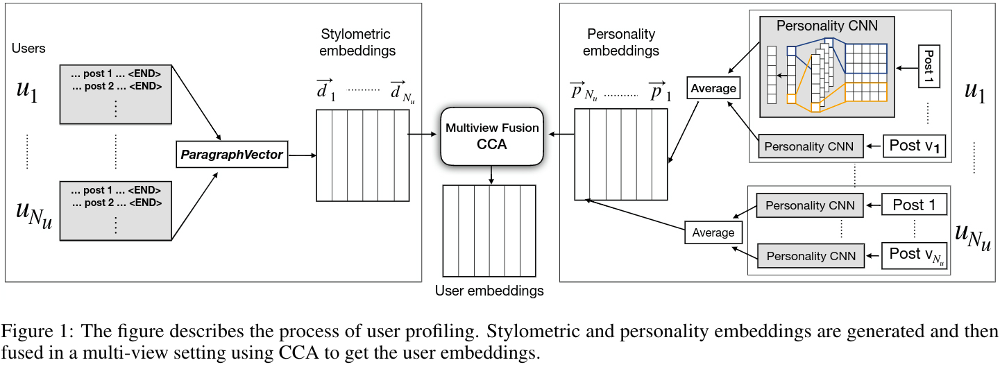
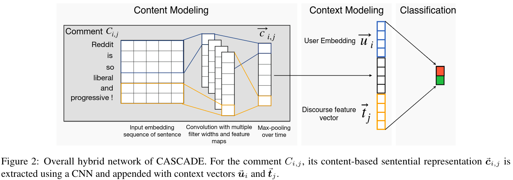

# CASCADE: Contextual Sarcasm Detection in Online Discussion Forums

Code for the paper [CASCADE: Contextual Sarcasm Detection in Online Discussion Forums](http://aclweb.org/anthology/C18-1156) (COLING 2018, New Mexico).

## Description

In this paper, we propose a ContextuAl SarCasm DEtector (CASCADE), which adopts a hybrid approach of both content and context-driven modeling for sarcasm detection in online social media discussions (Reddit).

## Requirements

1. Clone this repo.
2. Python (2.7 or 3.3-3.6)  
3. Install your preferred version of TensorFlow 1.4.0 (for CPU, GPU; from PyPI, compiled, etc).
4. Install the rest of the requirements: `pip install -r requirements.txt`
5. Download the [FastText pre-trained embeddings](https://s3-us-west-1.amazonaws.com/fasttext-vectors/crawl-300d-2M.vec.zip) and extract it somewhere.
6. Download the [`comments.json` dataset file](https://drive.google.com/file/d/1ew-85sh2z3fv1yGgIwBoeIHUvP8fMnxU/view?usp=sharing) [1] and place it in `data/`.
7. If you want to run the Preprocessing steps (optional), install YAJL 2, download [the `train-balanced.csv` file](https://drive.google.com/file/d/18GwcTqXo_lcMJmc5ms6s2KaL0Dh-95GP/view), save it under `data/` and continue with the [Preprocessing instructions](#preprocessing). Otherwise, just download [user_gcca_embeddings.npz](https://drive.google.com/file/d/1mQoe_48LO67plyo98DVeCC9NabVXdm82/view?usp=sharing), place it in `users/user_embeddings/` and go directly to [Running CASCADE section](#running-cascade).

## Preprocessing

<p align="center">
  
</p>

1. User Embeddings: Stylometric features.

    The file `data/comments.json` has Reddit users and their corresponding comments. Per user, there might be multiple number of comments. Hence, we concatenate all the comments corresponding to the same user with the `<END>` tag:

    ```bash
    cd users
    python create_per_user_paragraph.py
    ```

    The ParagraphVector algorithm is used to generate the stylometric features. First, train the model:

    ```bash
    python train_stylometric.py
    ```
        
    Generate `user_stylometric.csv` (user stylometric features) using the trained model:
     
    ```bash
    python generate_stylometric.py
    ```

2. User Embeddings: Personality features

    Pre-train a CNN-based model to detect personality features from text. The code utilizes two datasets to train. The second dataset [2] can be obtained by requesting it to the original authors.
     
    ```bash
    python process_data.py [path/to/FastText_embedding]
    python train_personality.py
    ```

    Generate `user_personality.csv` (user personality features) using this model:

    ```bash
    python generate_user_personality.py
    ```
    
    To use the pre-trained model from our experiments, download the [model weights](https://drive.google.com/file/d/1KK0p6tStgaEXLtAni1u3_W2jGlq8g1Nq/view?usp=sharing) and unzip them inside the folder `user/`.

3. User Embeddings: Multi-view fusion

    Merge the `user_stylometric.csv` and `user_personality.csv` files into a single merged `user_view_vectors.csv` file:
    
    ```bash
    python merge_user_views.py
    ```
    
    Multi-view fusion of the user views (stylometric and personality) is performed using GCCA (~ CCA for two views). Generate fused user embeddings `user_gcca_embeddings.npz` using the following command:
    
    ```bash
    python user_wgcca.py --input user_embeddings/user_view_vectors.csv --output user_embeddings/user_gcca_embeddings.npz --k 100 --no_of_views 2
    ```
    
    This implementation of GCCA has been adapted from the [wgcca repo](https://github.com/abenton/wgcca).
    
    Finally:
    
    ```bash
    cd ..
    ```

4. Discourse Embeddings

    Similar to user stylometric features, create the discourse features for each discussion forum (sub-reddit):
    
    ```bash
    cd discourse
    python create_per_discourse_paragraph.py
    ```
    
    The ParagraphVector algorithm is used to generate the stylometric features. First, train the model:
    
    ```bash
    python train_discourse.py
    ```
    
    Generate `discourse.csv` (user stylometric features) using the trained model:
     
    ```bash
    python generate_discourse.py
    ```
    
    Finally:
    
    ```bash
    cd ..
    ```

## Running CASCADE

<p align="center">
  
</p>

Hybrid CNN combining user-embeddings and discourse-features with textual modeling.
 
```bash
cd src
python process_data.py [path/to/FastText_embedding]
python train_cascade.py
```

The CNN codebase has been adapted from the [repo cnn-text-classification-tf from Denny Britz](https://github.com/dennybritz/cnn-text-classification-tf).

## Citation

If you use this code in your work then please cite the paper [CASCADE: Contextual Sarcasm Detection in Online Discussion Forums](http://aclweb.org/anthology/C18-1156) with the following:

```
@InProceedings{C18-1156,
  author = 	"Hazarika, Devamanyu
		and Poria, Soujanya
		and Gorantla, Sruthi
		and Cambria, Erik
		and Zimmermann, Roger
		and Mihalcea, Rada",
  title = 	"CASCADE: Contextual Sarcasm Detection in Online Discussion Forums",
  booktitle = 	"Proceedings of the 27th International Conference on Computational Linguistics",
  year = 	"2018",
  publisher = 	"Association for Computational Linguistics",
  pages = 	"1837--1848",
  location = 	"Santa Fe, New Mexico, USA",
  url = 	"http://aclweb.org/anthology/C18-1156"
}
```

## References

[1]. Khodak, Mikhail, Nikunj Saunshi, and Kiran Vodrahalli. ["A large self-annotated corpus for sarcasm."](https://arxiv.org/abs/1704.05579) Proceedings of the Eleventh International Conference on Language Resources and Evaluation. 2018.

[2]. Celli, Fabio, et al. ["Workshop on computational personality recognition (shared task)."](http://www.aaai.org/ocs/index.php/ICWSM/ICWSM13/paper/download/6190/6306) Proceedings of the Workshop on Computational Personality Recognition. 2013.
